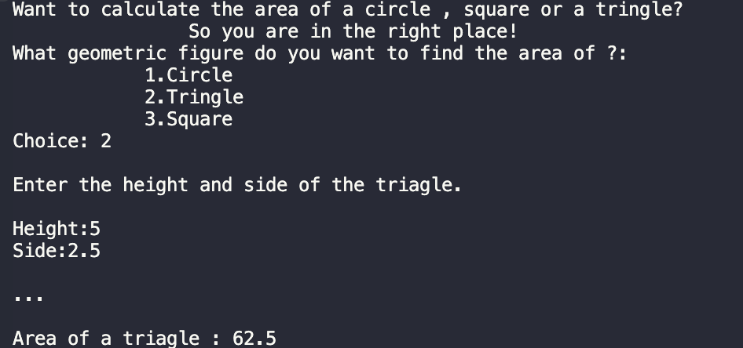
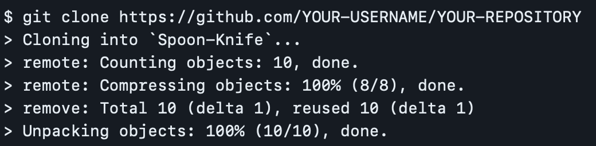

# GeometryGuru
- ### This development will help you calculate the area of a circle , triangle or square.

#### Formula:
C#
Circle:
const double PI = Math.PI;
double radius = Convert.ToDouble(Console.ReadLine());
double area = PI * (radius * radius);
Triangle:
double heightOfTriagle = Convert.ToDouble(Console.ReadLine());
double sideOfTriagle = Convert.ToDouble(Console.ReadLine());
double areaOfTriagle = sideOfTriagle * (heightOfTriagle * heightOfTriagle);
Square:
double sideOfSquare = Convert.ToDouble(Console.ReadLine());
double areaOfSquare = sideOfSquare * sideOfSquare;

#### Types:
C#
int & double & string & const
#### Operators:
C#
if(){...}
else{...}
The ***if-else*** construct is able to check one or more conditions, and if the condition is not true, then execute another code or check another condition.

#### Functions:
C#
Output to console: Console.WriteLine();
Input from console: Console.ReadLine();
Converts: Convert.ToDouble();
A *constant* is a value that remains unchanged during program execution.
* Also in the code i used ***Escape Characters*** - replacement of control characters in the text with corresponding text substitutions.
Read more , [link](https://codebuns.com/csharp-basics/escape-sequences/).

#### Demo:

If statement:

If you want to see the old version , follow the [link](https://github.com/ZafarUrakov/GeometryGuru/tree/releases/v2.0) !

### You can take my code and try it yourself !

1.About the list of files,click <> Code.

2.Copy the URL(HTTPS) of the repository.

3.Open terminal.

4.Change the current working catalogue ti the location where the cloned catalogur should be located.

5.Type "***git clone***" and paste the URL copied earlier.

6.Press enter to create a local clone.

To see other projects click [HERE](https://github.com/ZafarUrakov).