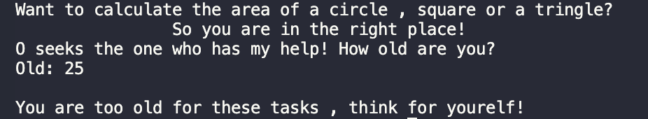
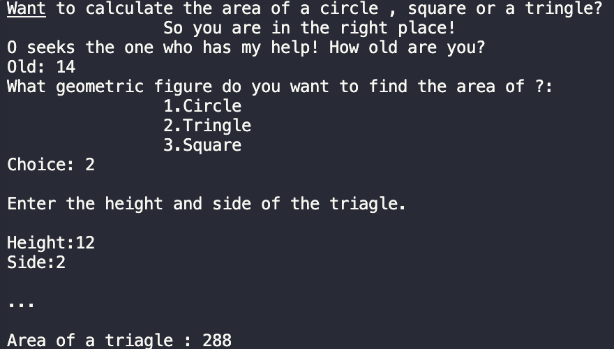

# GeometryGuru
- ### This development will help you calculate the area of a circle , triangle or square.

#### Formula:
```C#
Circle:
const double PI = Math.PI;
double radius = Convert.ToDouble(Console.ReadLine());
double area = PI * (radius * radius);
Triangle:
double heightOfTriagle = Convert.ToDouble(Console.ReadLine());
double sideOfTriagle = Convert.ToDouble(Console.ReadLine());
double areaOfTriagle = sideOfTriagle * (heightOfTriagle * heightOfTriagle);
Square:
double sideOfSquare = Convert.ToDouble(Console.ReadLine());
double areaOfSquare = sideOfSquare * sideOfSquare;
```

#### Types:
```C#
int & double & string & const
```
#### Operators:
```C#
if(){...}
else{...}
```
The ***if-else*** construct is able to check one or more conditions, and if the condition is not true, then execute another code or check another condition.
```C#
switch
```
The ***switch*** statement provides multidirctional brancing in the program.

#### Functions:
```C#
Output to console: Console.WriteLine();
Input from console: Console.ReadLine();
Converts: Convert.ToDouble();
```
A *constant* is a value that remains unchanged during program execution.
* Also in the code i used ***Escape Characters*** - replacement of control characters in the text with corresponding text substitutions.
Read more , [link](https://codebuns.com/csharp-basics/escape-sequences/).


#### Demo:
Option 1:


Option 2:


If statement:


Switch statement:


## Release Notes
In the [first](https://github.com/ZafarUrakov/GeometryGuru/tree/releases/v1.0) version of the project , we used only arithmetic operations with input and output to the console , and it was only possible to calculate the area of a circle.

As for this version , you can already find the are of circle , a triangle , and another square , is not that cool? In general you can see changes in the code like :

- The work of the code has been made easier.
- Logical operators such as switch and if-else have been added.
- Same buds have been fixed.

This is not all , there will be changes soon.

####  You can take my code and try it yourself 👇🏻

1.About the list of files,click <> Code.


2.Copy the URL(HTTPS) of the repository.


3.Open terminal.

4.Change the current working catalogue ti the location where the cloned catalogur should be located.

5.Type "***git clone***" and paste the URL copied earlier.


6.Press enter to create a local clone.


To see other projects click [HERE](https://github.com/ZafarUrakov).