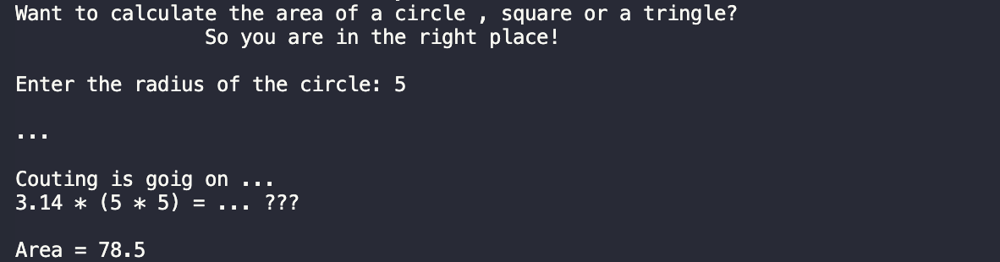

# GeometryGuru
- ### This development will help you calculate the area of a circle , triangle or square.

#### Formula:
```C#
const double PI = Math.PI;
double radius = Convert.ToDouble(Console.ReadLine());
double area = PI * (radius * radius);
```

#### Types:
```C#
double & string & const
```
#### Functions:
```C#
Output to console: Console.WriteLine();
Input from console: Console.ReadLine();
Converts: Convert.ToDouble();
```
A *constant* is a value that remains unchanged during program execution.
  
Also in the code i used ***Escape Characters*** - replacement of control characters in the text with corresponding text substitutions.
Read more , [link](https://codebuns.com/csharp-basics/escape-sequences/).


#### Demo:


### You can take my code and try it yourself !

1About the list of files,click <> Code.


2.Copy the URL(HTTPS) of the repository.


3.Open terminal.

4.Change the current working catalogue ti the location where the cloned catalogur should be located.

5.Type "***git clone***" and paste the URL copied earlier.


6.Press enter to create a local clone.


To see other projects click [HERE](https://github.com/ZafarUrakov).
